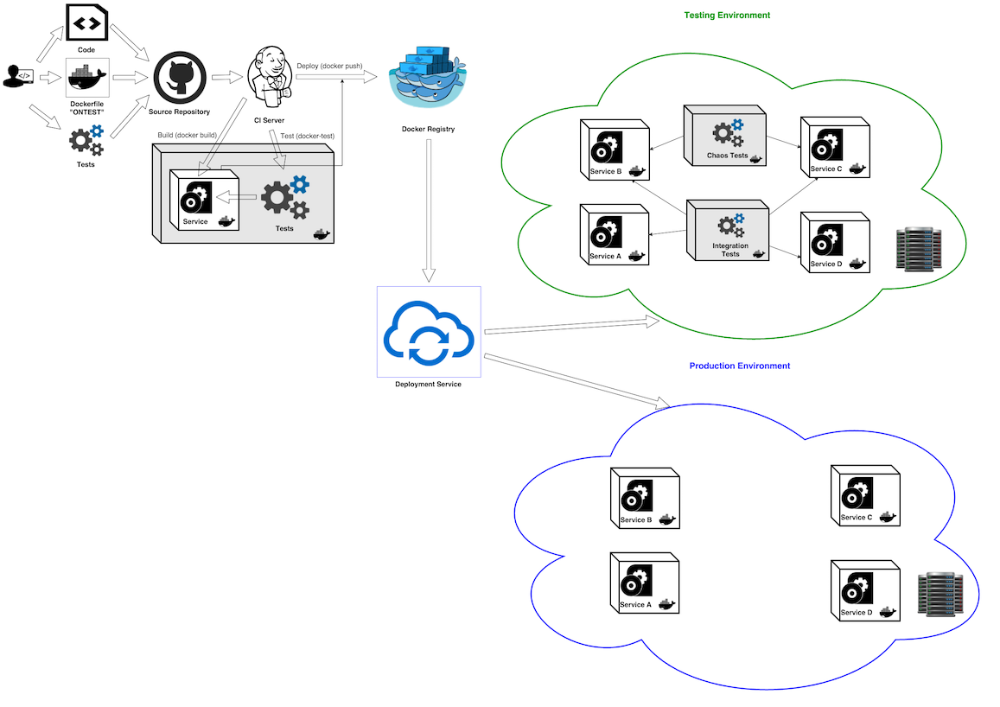

# Learn Configuration Testing Amplification
This repository contains courseware to master test configuration amplification.

Here you will learn how to amplify your container-based test configuration in order to maximize test coverage on several automatically generated configurations for your code, leveraging **[CAMP](https://github.com/STAMP-project/camp)** technology.

## Table of contents
  - [Configuration Testing: why should I care of them?](#conf-testing-why-should-i-care-of-them)
  - [CAMP to boost your test configuration processes](#camp-to-boost-your-test-configuration-processes)

## Configuration Testing: why should I care of them?
Everyone is aware about the benefits of containerizing applications, so why not to leverage containerization for system tests? Packaging tests as a Docker image allows us to quickly run tests across several different configurations, in a consistent and repeatable way. And "repeatable" lead us quickly to use this approach in CD pipelines.
The following diagram summarizes these concepts:

*(source: https://hackernoon.com/testing-strategies-for-docker-containers-f633e261e75a)*

For a more general introduction, read [Testing Strategies for Docker Containers](https://hackernoon.com/testing-strategies-for-docker-containers-f633e261e75a) and [Containerizing Test Tooling: Creating your Dockerfile and Makefile](https://www.docker.com/blog/containerizing-test-tooling-creating-your-dockerfile-and-makefile/)

## CAMP to boost your test configuration processes
Now lets go a step further on automating test configuration processes: designing several combination of different database products M(ySQL, PostgreSQL), application servers (JBoss/Wildfly, Tomcat), etc, taking into account also the different release each product has (MariaDB 10, Tomcat 7, JVM 13, etc) can take a lot of time and doing it manually doesn't guarantee to cover all products.

That's where CAMP comes.

With CAMP you can:
1. Generate several test configurations to use within your CI (for instance using [Testcontainers](https://www.testcontainers.org/) to write your e2e tests)
1. Generate test configurations and execute tests directly in your CI

To start with CAMP, please refer to [official GitHub CAMP companion web site](https://stamp-project.github.io/camp/).
