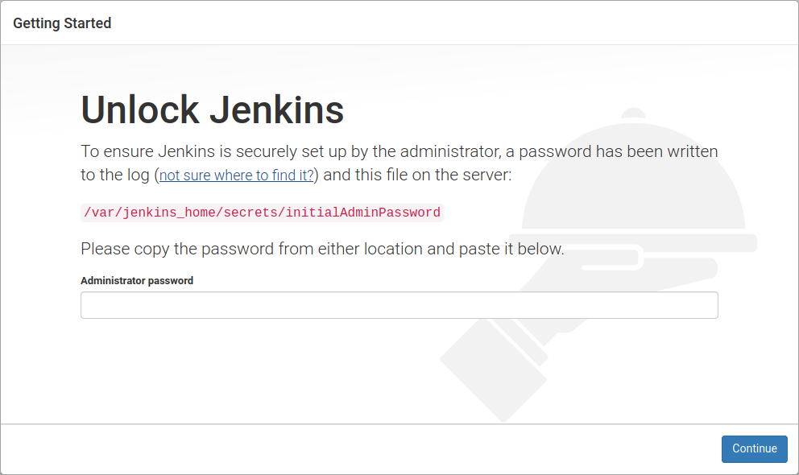
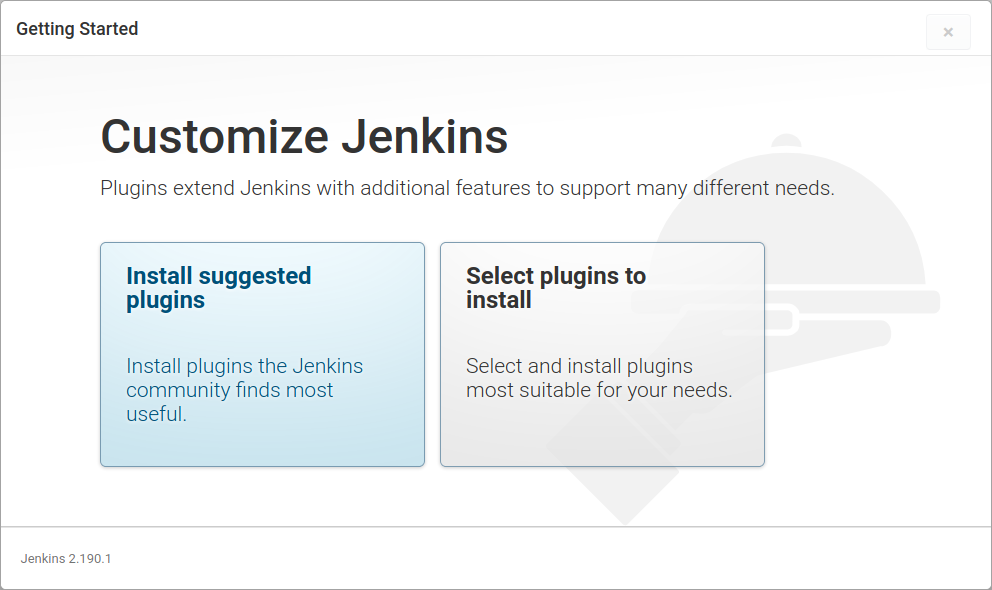
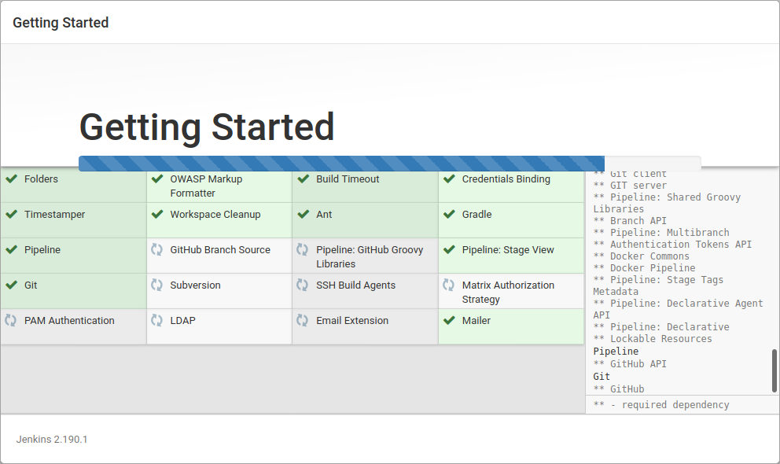
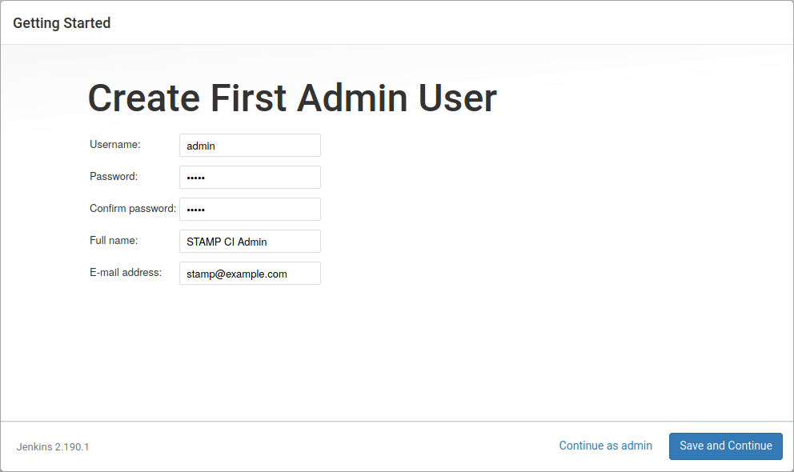
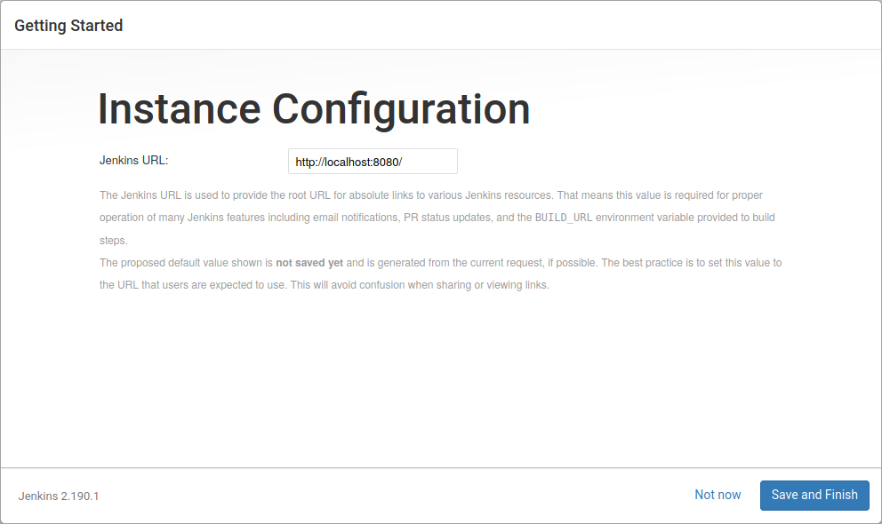
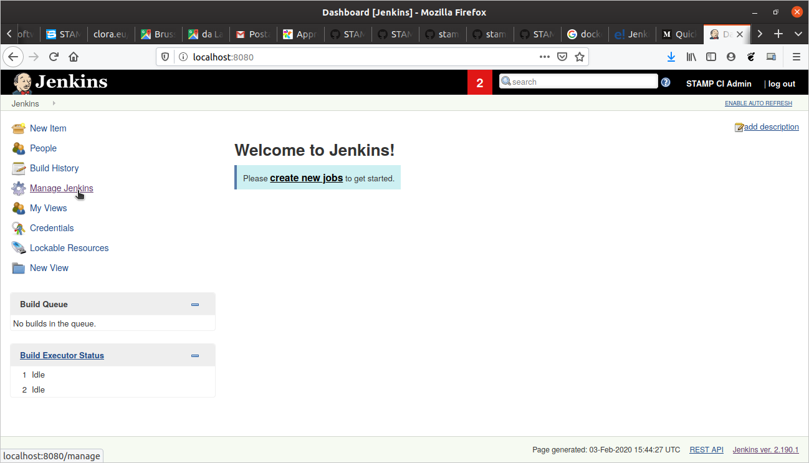
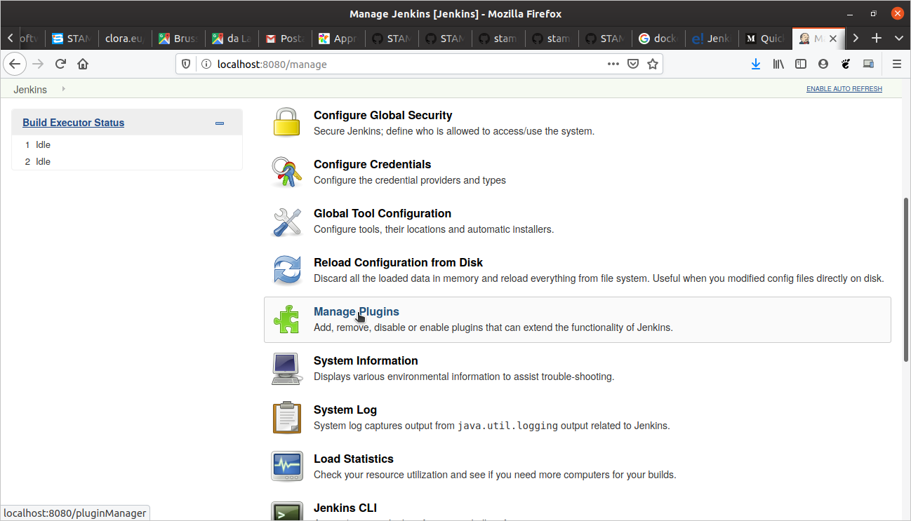
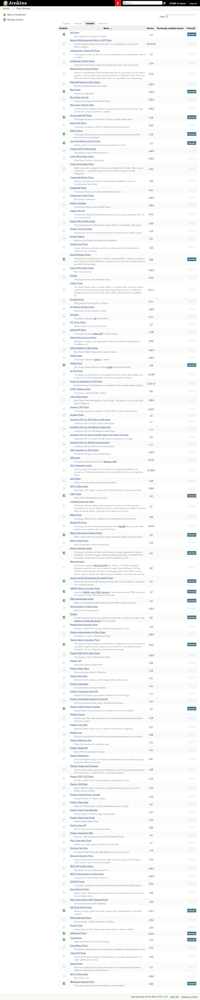

# STAMP DevOps Docker image
This image provides you with a self-contained environment to learn how to use STAMP in your CI/CD.

It contains:
- a fully functional Jenkins instance
- Python 3 installation
- CAMP 0.6.2
- CAMP dependencies:
  - Z3 solver, version 4.7.1
  - Docker
  - Docker Compose

To run it, simply execute:
```
docker run -p 8080:8080 -p 50000:50000 -v /var/run/docker.sock:/var/run/docker.sock -v jenkins_home:/var/jenkins_home danzone/stamp-devops:0.0.1 
```
This command will download and run a Jenkins CI server in your machine, and STAMP components to perform unit test amplification and test configuration amplification within it. For more information about first steps, go [here](#first-execution).

At [this page](https://github.com/jenkinsci/docker/blob/master/README.md) you'll find useful information from Official Jenkins Docker image documentation about how to configure and use it.

The `-v /var/run/docker.sock:/var/run/docker.sock` option is needed to share the docker deamons of the host with the CAMP container. CAMP can therefore invoke docker and create “siblings” containers.

The `-v jenkins_home:/var/jenkins_home` option is needed to let all Jenkins data (builds, plugins, etc) survive the container stop/restart/deletion.

## Table of contents

  - [First execution](#first-execution)
  - [Stopping and restarting STAMP DevOps Docker image](#stopping-and-restarting-stamp-devops-docker-image)

## First execution
When you execute the STAMP DevOPs Docker image for the first time, the console will show you a admin password to start jenkins initial setup. The text with password is:

```
*************************************************************
*************************************************************
*************************************************************

Jenkins initial setup is required. An admin user has been created and a password generated.
Please use the following password to proceed to installation:

7295013ca4424e5b994b63cdc0eb49e6

This may also be found at: /var/jenkins_home/secrets/initialAdminPassword

*************************************************************
*************************************************************
*************************************************************
```
You can access your STAMP CI environment at [http://localhost:8080/](http://localhost:8080/). 

You will see this screen:



In next screen, select “Install suggested plugins”



Jenkins CI will start to download all needed components and will install them:



and then create your STAMP CI Admin account:



Last step, confirm Jenkins URL:



Login and Jenkins will provide you with the Jenkins home dashboard:



After that you only need to install following plugins, and then you're ready to use STAMP in your CI/CD pipelines:

  - HTML Publisher
  - Blue Ocean
  - Maven Integration
  - Pipeline Maven Integration

Got to Jenkins plugin management and select them in the "Available section":



After the installation, restart Jenkins (selecting restart Jenkins in plugin installation page):


Finally you can login and you will see those new plugins installed:
 

## Stopping and restarting STAMP DevOps Docker image

To stop STAMP CI Docker container simply press Ctrl-C in the console in which you run it, or use usual Docker commands.

To restart it, simply type:

```
docker run -p 8080:8080 -p 50000:50000 -v /var/run/docker.sock:/var/run/docker.sock -v jenkins_home:/var/jenkins_home danzone/stamp-devops:0.0.1
```

The `-v jenkins_home:/var/jenkins_home` option is needed to attach all existing STAMP CI data to the current container.