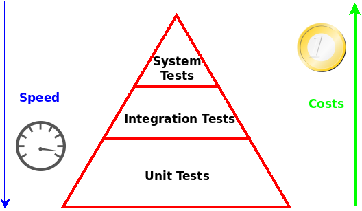

# Learn Unit Testing Amplification
This repository contains courseware to master unit test amplification.

Here you will learn how to assss your test suites, leveraging extreme mutation testing provided by **[Descartes](https://github.com/STAMP-project/pitest-descartes)**.

And then you will learn how to strenghten your test suites, applying test ampification technology provided by **[DSpot](https://github.com/STAMP-project/dspot)**.

## Table of contents
  - [Unit Testing: why should I care of them?](#unit-testing-why-should-i-care-of-them-unit-testing-intro)
  - [How good are my unit tests?](#how-good-are-my-unit-tests-learn-descartes)
  - [STAMP, please amplify them, they are not so good](#stamp-please-amplify-them-they-are-not-so-good-learn-dspot)

## Unit Testing: why should I care of them?

They are the first level of software testing, executed prior to integration testing and:
1. They increase confidence in changing and maintaining code
1. Their execution can be easily automated in a CI process.
1. Development is faster. Several unit testing frameworks are available for a lot of languages (yes, also for [Cobol](https://github.com/neopragma/cobol-unit-test) :-)). Here we will focus on **[Java](https://openjdk.java.net/)** and **[JUnit](https://junit.org/)**
1. The cost of fixing a defect during unit testing is lessere in comparison to that of defect detrcted at higher levels.

For a good introduction to unit testing, you can refer to this [good tutorial](https://www.vogella.com/tutorials/JUnit/article.html).

## How good are my unit tests?
Good question. STAMP is here to help you to assess how good are your test suites, with **[Descartes](https://github.com/STAMP-project/pitest-descartes)**.

**[Descartes](https://github.com/STAMP-project/pitest-descartes)** inject changes in your code at runtime, while you're executing your test suites, and check whether your test suites realize that something happened.
If your test cases terminate with a failure, good news: they have been able to detect the injected change, they are strong enough.
But if your test cases terminate with a success, bad news: they didn't realize that something wrong happened to your code.

Curious to see how it works? Please follow the **["Descartes for dummies" tutorial](https://github.com/STAMP-project/pitest-descartes/blob/master/docs/descartes-for-dummies-mvn.md)**.

Does your Maven project have several modules? Yes, we know that PIT works just with single module projects. That's why we developed **[PitMP](https://github.com/STAMP-project/pitmp-maven-plugin)**, an extension to PIT to work also with multi-module projects. Being Descartes a PIT plugin, in this way you will be able to apply extreme mutation testing also to your Maven multi-module projects. If you want to understand how to use Descartes-PitMP with your multi-module projects, please see the **[DNoo project](https://github.com/STAMP-project/dnoo)**. In the home page you'll find instructions to see how to run extreme mutation testing in this context.

Are you a Gradle user? No problem, please follow the **["Descartes for dummies (who prefer Gradle)" tutorial](https://github.com/STAMP-project/pitest-descartes/blob/master/docs/descartes-for-dummies-gradle.md)**.

Do you prefer to assess your test suites within your preferred IDE? No problem! You can install the [STAMP IDE](https://github.com/STAMP-project/stamp-ide) in your Eclipse instance. Please follow this **[guide](https://github.com/STAMP-project/stamp-ide/blob/master/README_Descartes.md)**.

**[Descartes](https://github.com/STAMP-project/pitest-descartes)** is a mutation engine for **[PIT](https://pitest.org/)**, "*the Gold Standard of mutation testing for Java and JVM*.
If you want to put your hands on classical mutation testing techniques, please follow this [tutorial](https://www.mkyong.com/maven/maven-pitest-mutation-testing-example/).

## STAMP, please amplify them, they are not so good
Never mind, STAMP will take care of it, with **[DSpot](https://github.com/STAMP-project/dspot)**.

DSpot is a tool able to "amplify" your test suites, adding automatically new assertions and new input to your test cases. It is a gentleman: it doesn't modify directly your test cases, rather it store the amplified copy in a separate folder, in order to let you inspect them. You then could decide whether accept them in your code base or not.

Curious to see how it works? Please follow the **["DSpot for dummies" tutorial](https://github.com/STAMP-project/dspot/blob/master/docs/dspot-for-dummies.md)**.

Are you a Gradle user? No problem, please follow the **["DSpot for dummies (who prefer Gradle)" tutorial](https://github.com/STAMP-project/dspot/blob/master/docs/dspot-for-dummies.md#execute-an-analysis-with-dspot-on-a-gradle-project)**.

DSpot offers another interesting feature, which let you to assess, and fix, possible regressions introduced after a code change. The DSpot Diff Test Selector is able to select a subset of test classes and methods that execute the changed code between two versions of the same program. If you want to explore this feature, you can follow this **[example](https://github.com/STAMP-project/dspot/tree/master/dspot-diff-test-selection#running-example)**.

Do you prefer to amplify your test suites within your preferred IDE? No problem! You can install [STAMP IDE](https://github.com/STAMP-project/stamp-ide) in your Eclipse instance. Please follow this **[guide](https://github.com/STAMP-project/stamp-ide/blob/master/README_DSpot.md)**.

Amplify with a Web service? You could be interested in **[DSPot Web interface](https://github.com/STAMP-project/dspot/blob/master/dspot-web/README.md)**: there is a live prototype available at [http://dspot.kth-assert.net/](http://dspot.kth-assert.net/).

